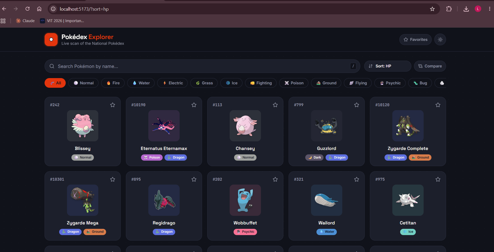
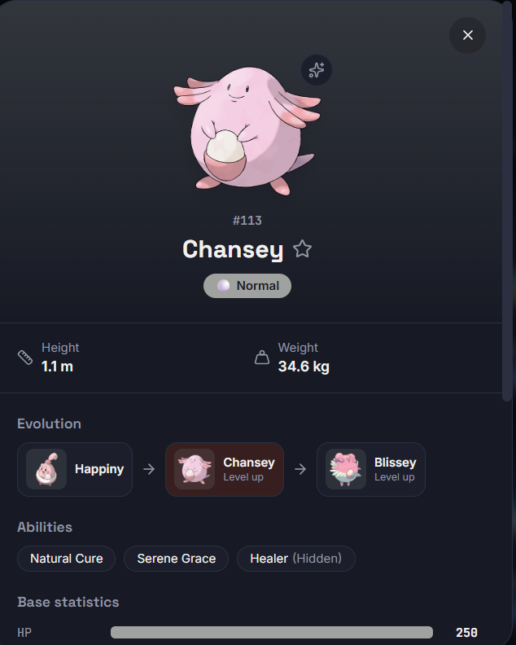
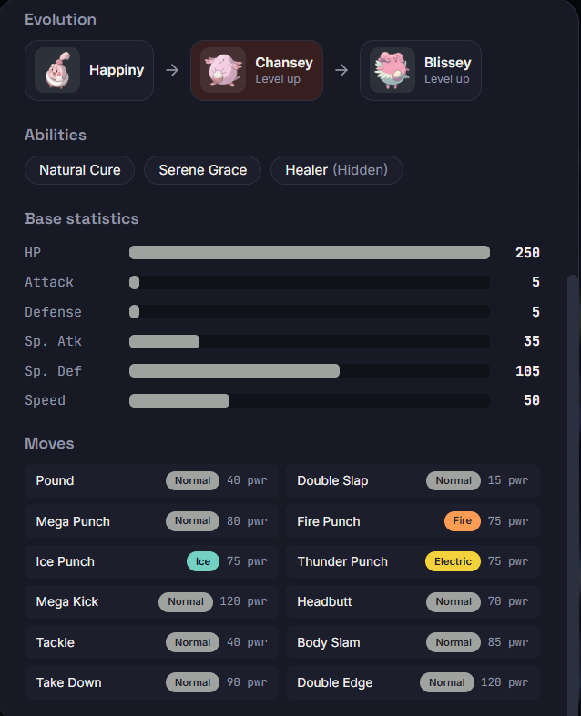
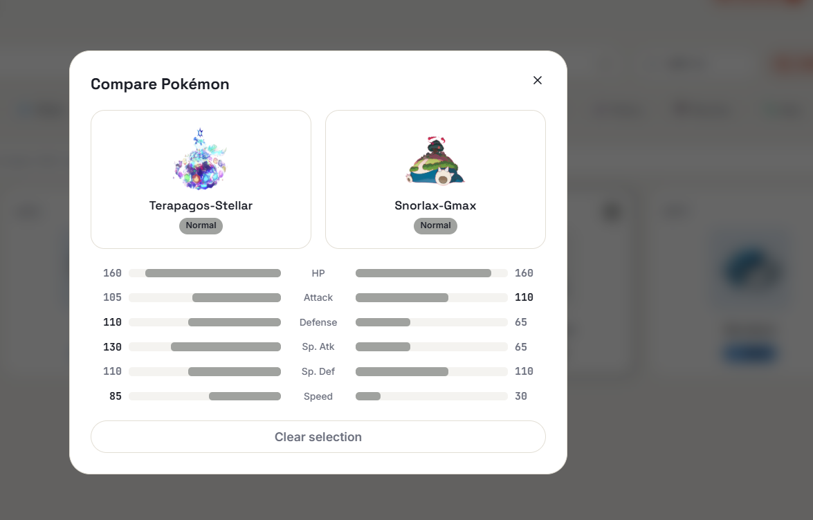
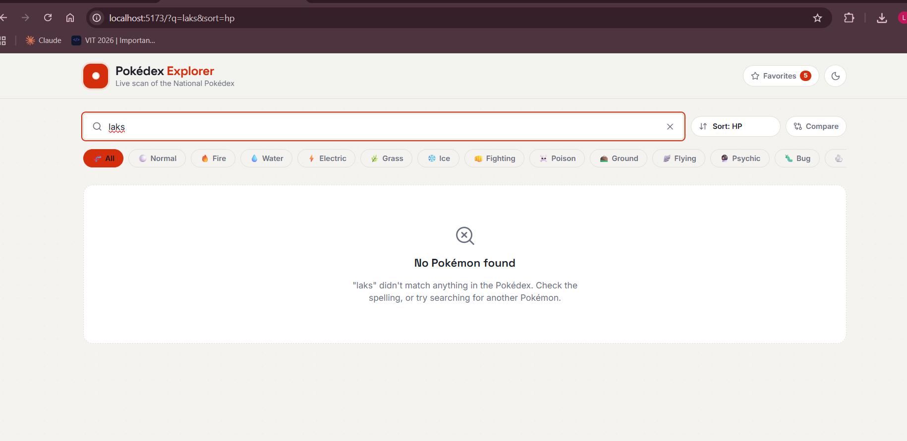
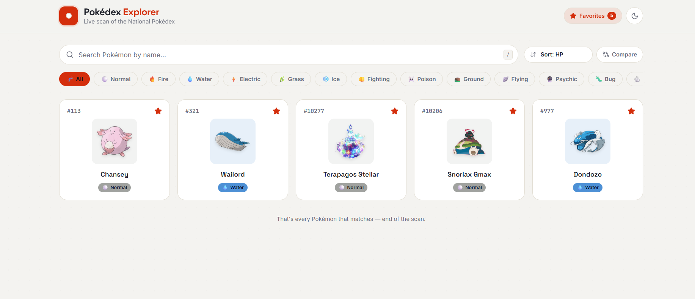
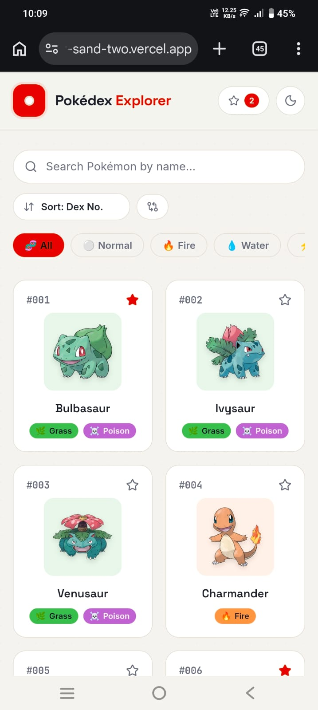

# ⚡ Pokémon Explorer

A modern, responsive Pokédex built with **React, TypeScript, and PokéAPI**. The project focuses on API integration, polished UI/UX, responsive design, accessibility, and reusable component architecture.

🔗 **Live Demo:** `https://pokemon-explorer-sand-two.vercel.app/`  
🔗 **GitHub:** `https://github.com/lakshmii-p/pokeman`

---

## ✨ Features

- 🧩 **Pokémon Listing** — Responsive card-based grid with image, ID, name, types, and type-based styling.
- 🔎 **Search** — Debounced Pokémon name search with a proper "not found" state.
- 📄 **Load More** — Incremental pagination using PokéAPI's `limit` and `offset`.
- 🔍 **Detailed View** — Large artwork, ID, types, height, weight, abilities, base stats, moves, shiny toggle, and evolution chain.
- 🏷️ **Type Filtering** — Filter Pokémon by type using PokéAPI.
- ↕️ **Sorting** — Sort by ID, name, Attack, Speed, or HP.
- ⭐ **Favorites** — Save favorite Pokémon using `localStorage`.
- 🌙 **Dark Mode** — Persistent light/dark theme with system preference support.
- ⚔️ **Compare** — Select two Pokémon and compare their base statistics.
- ⌨️ **Keyboard Accessibility** — Supports Enter, Space, Escape, Tab, and `/` for search.
- 🔗 **Shareable URLs** — Pokémon details are accessible through `/pokemon/:name`.
- ⏳ **Loading States** — Skeleton loaders and progress indicators for API operations.
- ⚠️ **Error Handling** — Independent error and retry states for different API sections.
- 📱 **Responsive Design** — Optimized for desktop, tablet, and mobile.
- ✨ **Animations** — Subtle card hover effects, button interactions, modal transitions, and skeleton animations.

---

## 🛠️ Tech Stack

- **React 19 + TypeScript**
- **Vite**
- **React Router**
- **Tailwind CSS v4**
- **Lucide React**
- **Vitest + React Testing Library**
- **PokéAPI**

---

## 🌐 API Used

**PokéAPI** — `https://pokeapi.co/api/v2/`

Main endpoints:

- `GET /pokemon?limit=20&offset=N` — Pagination
- `GET /pokemon/{name}` — Pokémon details
- `GET /pokemon/{id}` — Pokémon by ID
- `GET /type/{type}` — Type filtering
- `GET /pokemon-species/{name}` — Species information
- `GET /evolution-chain/{id}` — Evolution chain
- `GET /move/{name}` — Move information

No API key is required.

---

## 📁 Project Structure

    src/
    ├── components/    # Cards, grid, modal, filters, loading/error UI
    ├── hooks/         # Browser, favorites, theme, debounce logic
    ├── services/      # PokéAPI integration and caching
    ├── types/         # TypeScript types
    ├── utils/         # Type-based styling utilities
    ├── App.tsx        # Routes and application composition
    └── main.tsx       # Application entry point

The project follows reusable components, clear separation of concerns, meaningful naming, TypeScript types, and responsive styling.

---

## 🚀 Installation

    git clone YOUR_GITHUB_URL
    cd pokemon-explorer
    npm install

---

## ▶️ Running Locally

    npm run dev

Open the local URL shown by Vite, usually:

    http://localhost:5173

### Production Build

    npm run build
    npm run preview

### Testing & Linting

    npm run test
    npm run lint

---

## 🧠 Challenges Faced

### Global Stat Sorting

PokéAPI does not provide server-side sorting by Attack, Speed, or HP. The application fetches the required Pokémon details in batches, tracks progress, sorts the complete candidate set, and then paginates the results.

### API Data & Performance

The Pokémon list endpoint does not contain complete type and stat information. Details are fetched when required and cached to avoid unnecessary repeated requests.

### Independent Error Handling

Different API sections such as details, moves, and evolution chains handle their own loading, error, and retry states so one failed request does not break the entire interface.

---

## 🚧 Future Improvements

- Add TanStack Query for advanced caching and request deduplication.
- Add a Random Pokémon feature.
- Add grid virtualization for very large result sets.
- Add a dedicated 404 page.
- Expand Pokémon comparison with additional statistics and type effectiveness.

---

## 📸 Screenshots

### 🏠 Home

### 🔍 Pokémon Details

### ⚔️ Compare Pokémon

### ⚠️ Error & Retry State

### ⭐ Favorites

### 📱 Mobile View

## 🎯 Assignment Coverage

This project implements the assignment's required Pokémon listing, search, pagination/load more, details, type filtering, responsive design, modern UI, animations, loading/error states, reusable architecture, and TypeScript.

It also implements all listed bonus features:

**Favorites • Dark Mode • Sorting • Compare Pokémon • Keyboard Accessibility • URL-Based Pokémon Sharing**

---

  Built with ⚛️ React + TypeScript + PokéAPI

